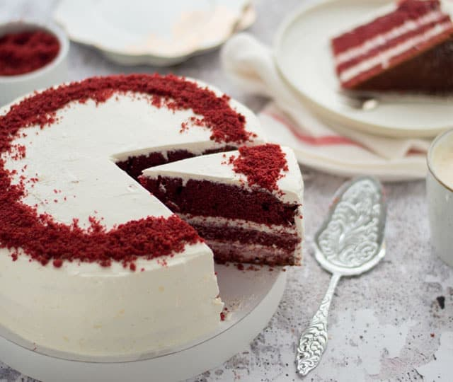

# Red Velvet Recept

## Ingrediëntenlijst

#### Voor de cake
* 250 ml karnemelk, op kamertemperatuur  
* 1-2 tl rode kleurstof
* 15 gr cacaopoeder
* 200 gr boter, op kamertemperatuur
* 300 gr suiker
* 1 tl vanille-extract
* ¼ tl zout
* 3 eieren, op kamertemperatuur
* 300 gr bloem
* 1 tl baking soda
* 2 tl witte wijnazijn

#### Voor de roomkaascrème
* 175 gr boter, op kamertemperatuur
* 150 gr poedersuiker
* 300 gr roomkaas, op kamertemperatuur
* 2 tl vanille-extract
##### Verder nodig
* boter, om in te vetten

## Red velvet taart maken
1. Verwarm de oven voor op 180 °C. 
2. Als je alledrie de cakes tegelijk wilt bakken kun je beter voor de hete-luchtstand van je oven kiezen, want dan kun je meerdere cakes boven elkaar bakken. 
3. Je kunt er ook voor kiezen om de cakes na elkaar te bakken. 
4. Vet 3 ronde *vormen met een doorsnede van 20 centimeter in met boter en leg een rond stuk bakpapier op de bodem.

## Beslag maken
1. Meng de karnemelk met de rode kleurstof en cacao door elkaar. 
2. Doe de boter, suiker, het vanille-extract en zout in een kom en klop dit in enkele minuten tot een romig geheel. 
3. Voeg vervolgens de eieren één voor één toe, waarbij je het volgende ei pas toevoegt als het * vorige volledig is opgenomen. 
4. Stop met mixen als alle eieren goed gemengd zijn en het mengsel luchtig is. 
5. Meng er de helft van het * karnemelk mengsel en de helft van de bloem door. 
6. Voeg vervolgens de rest van beide toe en meng ook de baking soda en witte wijnazijn door het beslag.

## Red velvet cake bakken
1. Verdeel het beslag over de drie bakvormen en bak de cakes in 25-30 minuten gaar. 
2. Stort ze op een rooster en laat ze zo afkoelen.

## Crème maken
1. Doe voor de roomkaascrème de boter met de poedersuiker in een kom en klop deze romig. 
3. Voeg vervolgens de roomkaas en het vanille-extract toe en klop alles door tot een gladde crème.

## Red velvet taart opbouwen
1. Snijd de drie cakes aan de bovenkant recht bij. 
2. Verkruimel de afsnijdsels en bewaar deze. Leg één cake op een bord en strijk daar een laag van de crème over. 
3. Bedek dit met de tweede cake en strijk ook daar een laag roomkaascrème over. 
4. Dek dit af met de derde cake en bestrijk de taart bovenop en aan de zijkanten met een dun laagje crème. 
5. Zet de taart minimaal 30 minuten in de koelkast.

## Bestrijk de taart met de rest van de roomkaascrème en strooi de achtergehouden cakekruimels erbovenop.

[Red Velvet Cake](https://rutgerbakt.nl/taart-recepten/red-velvet-taart-bakken-recept/)